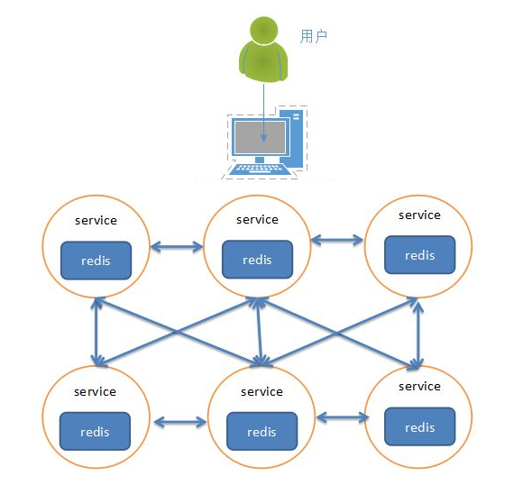

# <center>Django_Redis</center>

# Redis

## 1.nosql的介绍

NoSQL：一类新出现的数据库(not only sql)

- 泛指非关系型数据库
- 不支持SQL语法
- 存储结构跟传统关系型数据库中的那中关系表完全不同，nosql中存储的数据都是kv形式
- NoSQL的世界中没有一种通用的语言，每种nosql数据库都有自己的api以及语法，以及擅长的业务场景
- NoSQL中的产品种类相当多：
  - Reids
  - Mongodb
  - Hbase hadoop
  - Cassandra hadoop

## 2.NoSQL与SQL数据库的比较

- 适用场景不同：sql数据库适用于关系特别复杂的数据查询场景，nosql反之
- 事务特性的支持：sql对事务的支持非常完善，而nosql基本不支持事务
- 两者在不断的取长补短，呈现融合趋势

## 3.Redis

### 3.1Redis

#### 3.1.1简介：

- Redis是一个开源的使用ANSI C语言编写、支持网络、可基于内存亦可持久化的日志型、Key-Value数据库，并提供多种语言的API。从2010年3月15日起，Redis的开发工作由VMware主持。从2013年5月开始，Redis的开发由Pivotal赞助。
- Redis是 NoSQL技术阵营中的一员，它通过多种键值数据类型来适应不同场景下的存储需求，借助一些高层级的接口使用其可以胜任，如缓存、队列系统的不同角色

#### 3.1.2Redis特性

- Redis 与其他 key - value 缓存产品有以下三个特点：
- Redis支持数据的持久化，可以将内存中的数据保存在磁盘中，重启的时候可以再次加载进行使用。
- Redis不仅仅支持简单的key-value类型的数据，同时还提供list，set，zset，hash等数据结构的存储。
- Redis支持数据的备份，即master-slave模式的数据备份。

#### 3.1.3Redis 优势

- 性能极高 – Redis能读的速度是110000次/s,写的速度是81000次/s 。
- 丰富的数据类型 – Redis支持二进制案例的 Strings, Lists, Hashes, Sets 及 Ordered Sets 数据类型操作。
- 原子 – Redis的所有操作都是原子性的。
- 丰富的特性 – Redis还支持 publish/subscribe, 通知, key 过期等等特性。

#### 3.1.4Redis应用场景

- 用来做缓存(ehcache/memcached)——redis的所有数据是放在内存中的（内存数据库）
- 可以在某些特定应用场景下替代传统数据库——比如社交类的应用
- 在一些大型系统中，巧妙地实现一些特定的功能：session共享、购物车
- 只要你有丰富的想象力，redis可以用在可以给你无限的惊喜…….

### 3.2Redis的配置

- 绑定ip：如果需要远程访问，可将此⾏注释，或绑定⼀个真实ip

  > bind 127.0.0.1

- 端⼝，默认为6379

  > port 6379

- 是否以守护进程运⾏

  - 如果以守护进程运⾏，则不会在命令⾏阻塞，类似于服务
  - 如果以⾮守护进程运⾏，则当前终端被阻塞
  - 设置为yes表示守护进程，设置为no表示⾮守护进程
  - 推荐设置为yes

  > daemonize yes

- 数据⽂件

  > dbfilename dump.rdb

- 数据⽂件存储路径

  > dir /var/lib/redis

- ⽇志⽂件

  > logfile "/var/log/redis/redis-server.log"

- 数据库，默认有16个

  > database 16

- 主从复制，类似于双机备份。

  > slaveof

### 3.3数据操作

#### 3.3.1string键命令

- <a href="http://doc.redisfans.com/" target="_blank">Redis 参考命令</a>
- <a href="https://redis-py.readthedocs.io/en/latest/#indices-and-tables" target="_blank">Redis 官方文档</a>

- 设置键值

  >set key value

  - 例：设置键位 name 值位 goodboy
  
  > set name goodboy

- 设置键值及过期时间，以秒为单位

  >setex key seconds value

  - 例：设置键位aa值位aa过期时间位3秒的数据

  > setex aa 3 aa

- 查看有效时间，以秒为单位

  >ttl key

  - 例： 查看键aa的有效时间

  > ttl aa

- 设置多个键值

  >mset key1 value1 key2 value2

  - 例：设置键为a1的值为python设置键为a2的为java设置键3为c

  >mset a1 python a2 java a3 c

- 追加值

  > append key value

  - 例：向键为a1中加值haha

  >append a1 haha

__获取__

- 获取：根据键获取值，如果不存在此键则返回nil

  >get key

  - 例：获取键name的值

  >get name

- 根据多个键获取多个值

  >mget key1 key2....

  - 例：获取键a1、a2、a3的值

  >mget a1 a2 a3

__删除__

- 删除：根据键将该键对应的value删除

  >del key1 key2...

  - 例7：将a2 a3的值给删除

  > del a2 a3

__查找键__

- 查找键：查找键，参数支持正则表达式

  >keys pattern

  - 例1：查看所有键

  > keys *

  - 例2：查看名称中包含a的键

    >keys a*

- 判断键是否存在,如果存在则返回1，不存在则返回0

  >exists key1

  - 例：判断键a1是否存在

  >exists a1

- 查看键对应的value的类型

  > type key

  - 例：查看键a1的值类型，为redis支持的五种类型中的一种

  >type a1

#### 3.3.2hash键命令

- 设置单个属性

  > hset key field value

  - 例1：设置键 `user`的属性`name`为`itheima`

  > hset user name itheima

- 设置多个属性

  > hmset key field1 value1 field2 value2 ...

  - 例2：设置键`u2`的属性`name`为`itcast`、属性`age`为`11`

  > hmset u2 name itcast age 11

- 获取指定键所有的属性

  > hkeys key

  - 例3：获取键u2的所有属性

  > hkeys u2

- 获取⼀个属性的值

  > hget key field

  - 例4：获取键`u2`属性`name`的值

  > hget u2 name

- 获取多个属性的值

  > hmget key field1 field2 ...

  - 例5：获取键`u2`属性`name`、`age`的值

  > hmget u2 name age

- 获取所有属性的值

  > hvals key

  - 例6：获取键`u2`所有属性的值

  > hvals u2

- **删除整个hash键及值，使⽤del命令**

  >del key

- 删除属性，属性对应的值会被⼀起删除

  > hdel key field1 field2 ...

  - 例7：删除键`u2`的属性`age`

  > hdel u2 age

#### 3.3.3List键命令

- 列表的元素类型为string
- 按照插⼊顺序排序

- 在左侧插⼊数据

  > lpush key value1 value2 ...

  - 例1：从键为`a1`的列表左侧加⼊数据`a 、 b 、c`

  > lpush a1 a b c

- 在右侧插⼊数据

  > rpush key value1 value2 ...

  - 例2：从键为`a1`的列表右侧加⼊数据`0、1`

  > rpush a1 0 1

- 在指定元素的前或后插⼊新元素

  > linsert key before或after 现有元素 新元素

  - 例3：在键为`a1`的列表中元素`b`前加⼊`3`

  > linsert a1 before b 3

- 返回列表⾥指定范围内的元素

  - `start`、`stop`为元素的下标索引
  - 索引从左侧开始，第⼀个元素为0
  - 索引可以是负数，表示从尾部开始计数，如`-1`表示最后⼀个元素

  > lrange key start stop

  - 例4：获取键为`a1`的列表所有元素

  > lrange a1 0 -1

- 索引从左侧开始，第⼀个元素为0

- 索引可以是负数，表示尾部开始计数，如`-1`表示最后⼀个元素

  > lset key index value

  - 例5：修改键为`a1`的列表中下标为`1`的元素值为`z`

  > lset a 1 z

- 删除指定元素

  - 将列表中前`count`次出现的值为`value`的元素移除
  - count > 0: 从头往尾移除
  - count < 0: 从尾往头移除
  - count = 0: 移除所有

  > lrem key count value

  - 例6.1：向列表`a2`中加⼊元素`a、b、a、b、a、b`

  > lpush a2 a b a b a b

  - 例6.2：从`a2`列表右侧开始删除2个`b`

  > lrem a2 -2 b

  - 例6.3：查看列表`a2`的所有元素

  > lrange a2 0 -1

#### 3.3.4set键命令

- ⽆序集合
- 元素为string类型
- 元素具有唯⼀性，不重复
- 说明：对于集合没有修改操作
- 当set中最后一个元素被删除后该键自动删除内存回收

- 添加元素

  > sadd key member1 member2 ...

  - 例1：向键`a3`的集合中添加元素`zhangsan`、`lisi`、`wangwu`

  > sadd a3 zhangsan sili wangwu

- 返回所有的元素

  > smembers key

  - 例2：获取键`a3`的集合中所有元素

  > smembers a3

- 删除指定元素

  > srem key

  - 例3：删除键`a3`的集合中元素`wangwu`

  > srem a3 wangwu

#### 3.3.5zset键命令

- sorted set，有序集合
- 元素为string类型
- 元素具有唯⼀性，不重复
- 每个元素都会关联⼀个double类型的score，表示权重，通过权重将元素从⼩到⼤排序
- 说明：没有修改操作
- 当zset中最后一个元素被删除后该键自动删除内存回收

- 添加

  > zadd key score1 member1 score2 member2 ...

  - 例1：向键`a4`的集合中添加元素`lisi`、`wangwu`、`zhaoliu`、`zhangsan`，权重分别为`4、5、6、3`

  > zadd a4 4 lisi 5 wangwu 6 zhaoliu 3 zhangsan

- 返回指定范围内的元素

- start、stop为元素的下标索引

- 索引从左侧开始，第⼀个元素为0

- 索引可以是负数，表示从尾部开始计数，如`-1`表示最后⼀个元素

  > zrange key start stop

  - 例2：获取键`a4`的集合中所有元素

  > zrange a4 0 -1

- 返回`score`值在`min`和`max`之间的成员

  > zrangebyscore key min max

  - 例3：获取键`a4`的集合中权限值在`5和6之间`的成员

  > zrangebyscore a4 5 6

- 返回成员`member`的`score`值

  > zscore key member

  - 例4：获取键`a4`的集合中元素`zhangsan`的权重

  > zscore a4 zhangsan

- 删除指定元素

  > zrem key member1 member2 ...

  - 例5：删除集合`a4`中元素`zhangsan`

  > zrem a4 zhangsan

- 删除权重在指定范围的元素

  > zremrangebyscore key min max

  - 例6：删除集合`a4`中权限在`5、6之间`的元素

  > zremrangebyscore a4 5 6

### 3.4Redis主从搭建

**原型图：**


**概念：**

- ⼀个master可以拥有多个slave，⼀个slave⼜可以拥有多个slave，如此下去，形成了强⼤的多级服务器集群架构
- master用来写数据，slave用来读数据，经统计：网站的读写比率是10:1
- 通过主从配置可以实现读写分离
- master和slave都是一个redis实例(redis服务)


#### 配置主

- 查看当前主机的ip地址

  > ifconfig

  

- 修改`/etc/redis/redis.conf`文件

  > sudo vi redis.conf
  > bind 192.168.26.128

- 重启redis服务

  > sudo service redis stop
  > sudo redis-server redis.conf

#### 配置从

- 复制`/etc/redis/redis.conf`文件

  > sudo cp redis.conf ./slave.conf

- 修改`redis/slave.conf`文件

  > sudo vi slave.conf

- 编辑内容

  > bind 192.168.26.128
  > slaveof 192.168.26.128 6379
  > port 6378

- redis服务

  > sudo redis-server slave.conf

- 查看主从关系

  > redis-cli -h 192.168.26.128 info Replication

  

#### 数据操作

- 在master和slave分别执⾏info命令，查看输出信息 进入主客户端

  > redis-cli -h 192.168.26.128 -p 6379

- 进入从的客户端

  > redis-cli -h 192.168.26.128 -p 6378

- 在master上写数据

  > set aa aa

  

- 在slave上读数据

  > get aa

### 3.5搭建组群

#### 为什么要有集群

- 之前我们已经讲了主从的概念，一主可以多从，如果同时的访问量过大(1000w),主服务肯定就会挂掉，数据服务就挂掉了或者发生自然灾难
- 大公司都会有很多的服务器(华东地区、华南地区、华中地区、华北地区、西北地区、西南地区、东北地区、台港澳地区机房)

#### 集群的概念

- 集群是一组相互独立的、通过高速网络互联的计算机，它们构成了一个组，并以单一系统的模式加以管理。一个客户与集群相互作用时，集群像是一个独立的服务器。集群配置是用于提高可用性和可缩放性。 

当请求到来首先由负载均衡服务器处理，把请求转发到另外的一台服务器上。

#### redis集群

- 分类
  - 软件层面
  - 硬件层面
- 软件层面：只有一台电脑，在这一台电脑上启动了多个redis服务。



- 硬件层面：存在多台实体的电脑，每台电脑上都启动了一个redis或者多个redis服务。


#### 搭建集群

- 当前拥有两台主机172.16.179.130、172.16.179.131，这⾥的IP在使⽤时要改为实际值

#### 参考阅读

- <a href='http://www.cnblogs.com/wuxl360/p/5920330.html'>redis集群搭建</a>
- <a href='http://blog.5ibc.net/p/51020.html'>[Python]搭建redis集群</a>

- <a href = 'https://blog.csdn.net/weixin_52323239/article/details/125235358'>一文搞定windows下redis的集群搭建（三主三从）</a>

- <a href='WARNING: redis-trib.rb is not longer available! You should use redis-cli instead.'>WARNING: redis-trib.rb is not longer available! You should use redis-cli instead.</a>

#### python交互（先下载rediscluster 在指定下载redis）

```python
from rediscluster import *
if __name__ == '__main__':
  try:
    # 构建所有的节点，Redis会使⽤CRC16算法，将键和值写到某个节点上
    startup_nodes = [
        {'host': '192.168.206.1', 'port': '7000'},
        {'host': '192.168.206.1', 'port': '7003'},
        {'host': '192.168.206.1', 'port': '7001'},
    ]
    # 构建StrictRedisCluster对象
    src=StrictRedisCluster(startup_nodes=startup_nodes,decode_responses=True)
    # 设置键为name、值为itheima的数据
    result=src.set('name','itheima')
    print(result)
    # 获取键为name
    name = src.get('name')
    print(name)
  except Exception as e:
    print(e)
    raise
```

# Django

### 1.1**MVC模式与MVT模式**

**MVC模式说明**


- M全拼为Model，主要封装对数据库层的访问，对数据库中的数据进行增、删、改、查操作。
- V全拼为View，用于封装结果，生成页面展示的html内容。
- C全拼为Controller，用于接收请求，处理业务逻辑，与Model和View交互，返回结果。

**Django的MVT**


- M全拼为Model，与MVC中的M功能相同，负责和数据库交互，进行数据处理。
- V全拼为View，与MVC中的C功能相同，接收请求，进行业务处理，返回应答。
- T全拼为Template，与MVC中的V功能相同，负责封装构造要返回的html。

**注：差异就在于黑线黑箭头标识出来的部分**

### 1.2python中的虚拟环境

**为什么要搭建虚拟环境?**

- 在开发过程中, 当需要使用

  ```
  python
  ```

  的某些工具包/框架时需要联网安装

  - 比如联网安装Django框架django的1.11.11版本

    ```
    sudo pip install django==1.11.11
    ```

- **提示**：使用如上命令, 会将Django安装到`/usr/local/lib/python2.7/dist-packages`路径下

- **问题**：如果在一台电脑上, 想开发多个不同的项目, 需要用到同一个包的不同版本, 如果使用上面的命令, 在同一个目录下安装或者更新, 新版本会覆盖以前的版本, 其它的项目就无法运行了.

- 解决方案:

  ```
  虚拟环境
  ```

  - **作用**:`虚拟环境`可以搭建独立的`python运行环境`, 使得单个项目的运行环境与其它项目互不影响.
  - 所有的`虚拟环境`都位于`/home/`下的隐藏目录`.virtualenvs`下

**如何搭建虚拟环境?**

- 安装虚拟环境的命令 :

  ```
  sudo pip install virtualenv
  sudo pip install virtualenvwrapper
  ```

> 安装完虚拟环境后，如果提示找不到mkvirtualenv命令，须配置环境变量：

```
# 1、创建目录用来存放虚拟环境
mkdir 
$HOME/.virtualenvs

# 2、打开~/.bashrc文件，并添加如下：
export WORKON_HOME=$HOME/.virtualenvs
source /usr/local/bin/virtualenvwrapper.sh

# 3、运行
source ~/.bashrc
```

- 创建虚拟环境的命令 :

  - 提示：如果不指定python版本，默认安装的是python2的虚拟环境

  - 在python2中，创建虚拟环境

    ```
    mkvirtualenv 虚拟环境名称
    例 ：
    mkvirtualenv py_django
    ```

  - 在python3中，创建虚拟环境

    ```
    mkvirtualenv -p python3 虚拟环境名称
    例 ：
    mkvirtualenv -p python3 py3_django
    windows下 
    mkvirtualenv -p pythona安装路径 虚拟名称
    ```

- 提示 :

  - 创建虚拟环境需要联网
  - 创建成功后, 会自动工作在这个虚拟环境上
  - 工作在虚拟环境上, 提示符最前面会出现 “虚拟环境名称”

**如何使用虚拟环境?**

- 查看虚拟环境的命令 :

```
workon
```

- 使用虚拟环境的命令 :

```
workon 虚拟环境名称

例 ：使用py3_django的虚拟环境
workon py3_django
```

- 退出虚拟环境的命令 :

```
deactivate
```

- 删除虚拟环境的命令 :

```
rmvirtualenv 虚拟环境名称

例 ：删除虚拟环境py3_django

先退出：deactivate
再删除：rmvirtualenv py3_django
```

**如何在虚拟环境中安装工具包?**

[文档](https://pip.pypa.io/en/stable/user_guide/)

- 提示 : 工具包安装的位置 :
  - python2版本下：
    - `~/.virtualenvs/py_flask/lib/python2.7/site-packages/`
  - python3版本下：
    - `~/.virtualenvs/py3_flask/lib/python3.5/site-packages`
- python3版本下安装django-1.11.11的包 :

```
pip install 包名称

例 : 安装django-1.11.11的包
pip install django==1.11.11
```

- 查看虚拟环境中安装的包 :

```
pip list
```

### 1.3创建Django项目

- 创建Django项目

  - django-admin startproject 项目名称

   

- 与项目同名的目录，此处为bookmanager。

- **settings.py**是项目的整体配置文件。

- **urls.py**是项目的URL配置文件。

- **wsgi.py**是项目与WSGI兼容的Web服务器入口。

- **manage.py**是项目管理文件，通过它管理项目。


- **创建子应用**
  - python manager.py startapp name


- **admin.py**文件跟网站的后台管理站点配置相关。
- **apps.py**文件用于配置当前子应用的相关信息。
- **migrations**目录用于存放数据库迁移历史文件。
- **models.py**文件用户保存数据库模型类。
- **tests.py**文件用于开发测试用例，编写单元测试。
- **views.py**文件用于编写Web应用视图。

### 1.4 注册安装子应用

创建出来的子应用目录文件虽然被放到了工程项目目录中，但是django工程并不能立即直接使用该子应用，需要注册安装后才能使用。

在工程配置文件settings.py中，**INSTALLED_APPS**项保存了工程中已经注册安装的子应用，初始工程中的INSTALLED_APPS如下：


**注册安装一个子应用的方法，即是将子应用的配置信息文件apps.py中的Config类添加到INSTALLED_APPS列表中。**

例如，将刚创建的book子应用添加到工程中，可在INSTALLED_APPS列表中添加**'book.apps.BookConfig'**。


### 1.5模型文件生成以及迁移

```python
"""
1.定义模型
2.模型迁移
    2.1 先完成迁移文件(不会在数据库中生成表，只会创建一个 数据表和模型的对应关系)
    python manage.py makemigrations
    2.2在迁移(会在数据库中生成一个表)
    python manage.py migrate
"""
# Create your models here.
class BookInfo(models.Model):
    """
    1.主键 当前会自动生成
    2. 属性复制过来就行
    """
    name = models.CharField(max_length=10)


class PeopleInfo(models.Model):
    # 角色名
    name = models.CharField(max_length=10)
    # 角色性别
    gender = models.BooleanField()
    # 外键
    book = models.ForeignKey(BookInfo, on_delete=models.CASCADE)

```

**manage --help语句及含义**

```shell
生成
python manage.py makemigrations app名
迁移
python manage.py migrate app名

Available subcommands:

[auth]
    changepassword 
    createsuperuser #设置管理员账号

[contenttypes]
    remove_stale_contenttypes

[django]
    check # 检查语句
    compilemessages
    createcachetable
    dbshell
    diffsettings
    dumpdata
    flush
    inspectdb
    loaddata
    makemessages
    makemigrations # 生成迁移文件
    migrate   # 完成迁移
    sendtestemail
    shell
    showmigrations
    sqlflush
    sqlmigrate
    sqlsequencereset
    squashmigrations
    startapp # 创建子应用
    startproject # 创建项目
    test
    testserver

[sessions]
    clearsessions

[staticfiles]
    collectstatic
    findstatic
    runserver

```

### 1.6View和URL匹配流程


URL请求的流转

```yacas
客户端发送请求->服务器根据客户端发送的路由与工程中的URLS进行匹配，找到符合关系的则去到子应用中的URLS中寻找对应的方法,直到没有报错404，如果有的话根据视图方法返回数据。
```

### 1.7页面模板

- 1.创建模板
- 2.设置模板查找路径
- 3.模板接收视图传入的数据
- 4.模板处理数据

#### 1.创建模板

- 在"应用"同级目录下创建模板文件夹templates文件夹名称固定写法
- 在templates文件夹下，创建应用同名文件夹，例Book
- 在应用同名文件夹下创建网页模板文件，例 index.html

#### 2.设置模板查找路径

- 1.打开项目设置文件settinge.py
- 2.找到变量TEMPLATES给其中的'DIRS'字段添加属性
- 属性内容为'templates'文件的路径

#### 3.模板接收试图传入的数据

- 试图模板加载


#### 4.模板处理数据


### 1.8网页模板与数据传输展示

#### 需求


#### 实现步骤

- 1.创建视图
- 2.创建模板
- 3.配置URLconf

##### 1.创建试图

- 查询数据库数据

- 构造上下文

- 传递上下文到模板

  ```python
  # 定义试图：提供书籍列表信息
  def booklist(request):
      #查询数据库书籍列表数据
      books = BookInfo.object.all()
      # 构造上下文
      context = {'books':books}
      return render(request,"Book/booklist.html",context)
  ```

  

##### 2.创建模板

- 读取上下文数据

- 构造网页html文档：书籍信息以列表怎样展示

  ```html
  <!DOCTYPE html>
  <html lang="en">
  <head>
      <meta charset="UTF-8">
      <title>书籍信息</title>
      <style>
          a {
          text-decoration: none;
          color: black;
          }
          a:hover {
              color: aqua;
          }
      </style>
  </head>
  <body>
  <ul>
      
      <li><a href="{{ book.name }}" title="{{ book.name }}">{{ book.name }}</a></li>
          
  </ul>
  </body>
  </html>
  ```

##### 3.配置URLconf

- 进入应用中的urls.py文件

```python
from django.urls import path
from book.views import index, book_lis

"""
1.urlpatterns 是固定写法，它的值是列表
2.我们在浏览器中输入的路径会和 urlpatterns中的每一项进行匹配
    如果匹配成功，则直接引导到相应的模块
    如果不匹配则直接返回404
3.urlpatterns中的元素 path
    ptah的第一个参数是地址路径
4. 我们在浏览器中输入的路由 中哪些部分会参与匹配?
    http://ip:port/path/?key=value
    我们的http://ip:port/ 和get post等参数不参与正则匹配
5. 如果和当前的某一项匹配成功,则引导到子引用中继续匹配
    如果匹配成功，则停止匹配返回相应的视图
    如果匹配不成功，则继承和后边的工程中的url中的每一项继续匹配，知道匹配每一项
"""
urlpatterns = [
    path('index/', index),
    path('booklist/', book_lis),
]
```

### 1.9配置文件

#### 1.BASE_DIR

```python
BASE_DIR = os.path.dirname(os.path.dirname(os.path.abspath(__file__)))
```

当前工程的根目录，Django会依次来定位工程内的相关文件，我们也可以来使用该参数来构造文件路径

#### 2.DEBUG

调试模式，创建工程后初值为True，即默认的工作调试模式下。

作用：

- 修i该代码文件，程序自动重启
- Django程序出现异常时，向前端显示详细的错误追踪信息，例如


- 非调试模式下，仅返回Server Error（500）

注意：部署线上运行的Django不要运行在调试模式下，要修改DEBUG=False和ALLOW_HOSTS.

#### 3. 本地语言与时区

Django支持本地化处理，即显示语言与时区支持本地化。

本地化是将显示的语言、时间等使用本地的习惯，这里的本地化就是进行中国化，中国大陆地区使用**简体中文**，时区使用**亚洲/上海**时区，注意这里不使用北京时区表示。

初始化的工程默认语言和时区为英语和UTC标准时区

```
LANGUAGE_CODE = 'en-us'  # 语言
TIME_ZONE = 'UTC'  # 时区# 时区
```

将语言和时区修改为中国大陆信息

```
LANGUAGE_CODE = 'zh-Hans'
TIME_ZONE = 'Asia/Shanghai'
```

#### 4.静态文件

项目中会使用到的css、图片、js都是静态文件。一般会将静态文件放到在一个单独的目录中，以方便管理。在html页面中调用时，也需要指定静态文件的路径，Django中提供了一种解析方式配置静态文件路径。静态问及那可以放在项目根目录下，也可以放在应用的目录下，由于有写静态文件在项目中是通用的，所以推荐放在项目的根目录下，方便管理。

为了提供金静太文件，需要配置两个参数：

- __STATICFILES_DIRS__存放查找静态文件的目录
- __STATIC_URL__访问金泰文件的URL前缀

1. 在项目根目录下创建static目录来保存静态文件。
2. 在bookmanager/settings.py中修改文件的两个参数为

```python
STATIC_URL = '/static/'
STATICFILES_DIRS=[
	os.path.join(BASE_DIR,'static'),
]
```

3. 此时在static添加的任何静态文件都可以使用网址__/static/__文件在__static__中的路径来访问。

例如，我们向static目录中添加一个index.html文件，在浏览器中就可以使用127.0.0.1:8000/static/index.html来访问。

或者我们在static目录中添加了一个子目录和问及那book/detail.html，在浏览器中就可以使用127.0.0.1:8000/static/book/detail.html来访问。

__案例__


> STATIC_URL 设置的是静态资源请求路径
>
> STATICFILES_DIRS 设置的是静态资源储存位置

#### 5.子应用配置

>使用 python manage.py startapp <myappname>创建子应用
>
>其中<myappname>为子应用名称

创建成功后会在项目路径下创建一个子应用


给子应用配置信息

```python
# 在子项目中找到apps.py进行项目配置
```


子应用在项目里注册

```python
# 在项目文件中settings.py中配置子应用
# 在settings.py中找到 INSTALLED_APPS 变量
# 该变量 INSTALLED_APPS 的作用是 添加应用程序到应用列表
INSTALLED_APPS = [
    'django.contrib.admin',
    'django.contrib.auth',
    'django.contrib.contenttypes',
    'django.contrib.sessions',
    'django.contrib.messages',
    'django.contrib.staticfiles',
    '<MyAppName>.apps.BookConfig',
]
```

#### 6.定义模型类

- 模型类被定义在"应用/models.py"文件中。
- 模型类必须继承自Model类中，位于包django.db.models中。

在models.py文件中定义模型类。

```python
"""在book子应用中设置模型类"""
from django.db import models

# Create your models here.
"""
1. ORM
    表 --> 类
    字段 --> 属性

2. 模型类需要继承自models.Model

3. 模型类会自动为我们添加(生成)一个主键

4. 属性名=属性类型(选项)

    属性名: 不要使用 python,mysql关键字
            不要使用 连续的下划线(__)
    属性类型: 和mysql的类型类似的
    选项:  charfiled 必须设置 max_length同mysql中的varchar(M)
          null   是否为空
          unique 唯一
          default 设置默认值
          verbose_name 主要是 admin后台显示
"""
"""
书籍表:
    id,name,pud_date,readcount,commentcount,is_delete
"""


class BookInfo(models.Model):
    # 属性名 = 属性选项名
    # 书名
    name = models.CharField(max_length=10, unique=True, verbose_name='书名')
    # 发布时间
    pub_date = models.DateField(null=True)
    # 阅读量
    readcount = models.IntegerField(default=0)
    # 评论连那个
    commentcount = models.IntegerField(default=0)
    # 是否删除(逻辑删除)
    is_delete = models.BooleanField(default=False)
	
    # 使用db_table设置数据库表名
    class Meta:
        db_table = 'bookinfo'

    def __str__(self):
        return self.name


class PeopleInfo(models.Model):
     # 使用db_table设置数据库表名
    class Meta:
        db_table = 'peopleinfo'

    GENDER_CHOICES = [
        (0, 'MAN'),
        (1, 'WOMAN'),
    ]
    """
    default:用于设置默认值
    choices:设置枚举列表
    on_delete:指明主表删除数据时，对于外键引用表数据如何处理，在django.db.models中包含了可选常量：
        CASCADE级联，删除主表数据时连通一起删除外键表中数据
        PROTECT保护，通过抛出ProtectedError异常，来阻止删除主表中被外键应用的数据
        SET_NULL设置为NULL，仅在该字段null=True允许为null时可用
        SET_DEFAULT设置为默认值，仅在该字段设置了默认值时可用
        SET()设置为特定值或者调用特定方法
        DO_NOTHING不做任何操作，如果数据库前置指明级联性，此选项会抛出IntegrityError异常
    """
    #  姓名
    name = models.CharField(max_length=10, verbose_name='姓名')
    #  性别
    gender = models.SmallIntegerField(choices=GENDER_CHOICES, default=0, verbose_name='性别')
    #  人物描述
    description = models.TextField(default='', verbose_name='描述', null=True)
    #  人物出处
    book = models.ForeignKey(BookInfo, on_delete=models.CASCADE, verbose_name='书籍')
    #  是否被删除
    is_dlete = models.BooleanField(default=False, verbose_name='是否删除')

    def __str__(self):
        return self.name
```

1. 关于主键

   django会为创建自动增长的主键列，每个模型都只能有一个主键列，如果使用选项设置某属性为主键列后django不会再创建自动真正的主键列。

   默认创建的主键列属性为id，可以使用PK代替，Pk全拼为 primary key。

2. 属性命名限制

   不能是python 的保留关键字。

   不允许使用连续的下划线，这是由django的查询方式决定的。

   定义属性是需要指定字段类型，通过字段类型的参数指定选项，语法如下:

   > 属性=models.字段类型(选项

   __字段类型__

| 类型             | 说明                                                         |
| :--------------- | :----------------------------------------------------------- |
| AutoField        | 自动增长的IntegerField，通常不用指定，不指定时Django会自动创建属性名为id的自动增长属性 |
| BooleanField     | 布尔字段，值为True或False                                    |
| NullBooleanField | 支持Null、True、False三种值                                  |
| CharField        | 字符串，参数max_length表示最大字符个数                       |
| TextField        | 大文本字段，一般超过4000个字符时使用                         |
| IntegerField     | 整数                                                         |
| DecimalField     | 十进制浮点数， 参数max_digits表示总位数， 参数decimal_places表示小数位数 |
| FloatField       | 浮点数                                                       |
| DateField        | 日期， 参数auto_now表示每次保存对象时，自动设置该字段为当前时间，用于"最后一次修改"的时间戳，它总是使用当前日期，默认为False； 参数auto_now_add表示当对象第一次被创建时自动设置当前时间，用于创建的时间戳，它总是使用当前日期，默认为False; 参数auto_now_add和auto_now是相互排斥的，组合将会发生错误 |
| TimeField        | 时间，参数同DateField                                        |
| DateTimeField    | 日期时间，参数同DateField                                    |
| FileField        | 上传文件字段                                                 |
| ImageField       | 继承于FileField，对上传的内容进行校验，确保是有效的图片      |

**选项**

| 选项        | 说明                                                         |
| :---------- | :----------------------------------------------------------- |
| null        | 如果为True，表示允许为空，默认值是False                      |
| blank       | 如果为True，则该字段允许为空白，默认值是False                |
| db_column   | 字段的名称，如果未指定，则使用属性的名称                     |
| db_index    | 若值为True, 则在表中会为此字段创建索引，默认值是False        |
| default     | 默认                                                         |
| primary_key | 若为True，则该字段会成为模型的主键字段，默认值是False，一般作为AutoField的选项使用 |
| unique      | 如果为True, 这个字段在表中必须有唯一值，默认值是False        |

__null__是数据库范畴的概念，**blank**是表单验证的范畴

**外键设置**

在设置外键时，需要通过**on_delete**选项指明主表删除数据时，对于外键引用表数据如何处理，再django.db.models中包含了可选常量：

- **CASCADE**级联，删除主表数据时连通一起删除外键表中数据
- **PROTECT**保护，通过抛出**ProtectedError**异常，来阻止删除主表中被外键应用的数据
- **SET_NULL**设置为NULL，仅在该字段null=True允许为null时可用
- **SET_DEFAULT**设置为默认值，仅在该字段设置了默认值时可用
- **SET()**设置为特定值或者调用特定方法
- **DO_NOTHING**不做任何操作，如果数据库前置指明级联性，此选项会抛出**IntegrityError**异常

**数据迁移**

1. 生成迁移文件

   python  manage.py makemigrations

2. 同步到数据库中

   python manage.py migrate

**配置数据库信息**

1. 使用**MySQL**数据库首先需要先安装数据库驱动

   > pip3 install PyMySQL

2. 在Django的工程同名子目录的__init__.py文件中添加如下语句

   > import pymysql
   >
   >   
   >
   > pymysql.install_as_MySQLdb()

   作用是让Django的ORM能以mysqldb的方式来调用PyMySQL。

3. 修改**DATABASES**配置信息

   ```python
   DATABASES = {
       'default':{
           'ENGINE':'django.db.backends.mysql',
           'HOST':'localhost',
           'PORT': 3307,
           'USER': 'root'，
           'PASSWORD':'123456',
           'NAME':'book'
       }
   }
   ```

### 2.Django的shell小工具

#### 2.1shell

> 在cmd或pycharm中Terminal中
>
> 输入  python  manage.py  shell

#### 2.2使用shell对数据进行增 删 改

##### 2.22增加

- save

- 通过创建模型类对象，执行对象的save()方法保存到数据库中

  ```python
  >>> from book.models import BookInfo
  >>> book = BookInfo(
  ...         name='Python',
  ...         pub_date='2000-1-1'
  ...     )
  >>> book.save()   
  ```

- create

- 通过模型类.objects.create()保存

  

  出现上方样式即创建成功

##### 2.2.3修改

- save

- 修改模型类对象的属性，然后执行save()方法

  ```shell
   peson = PeopleInfo.objects.get(name='传智健康') 
  >>> peson.name = '黑马程序员'
  >>> peson.save()
  >>> peson
  ```

- update

- 使用模型类.objects.filter().update(),返回受影响的行数

  ```shell
  PeopleInfo.objects.filter(name='黑马程序员').update(name='传智播客')
  ```

##### 2.2.4删除

- 模型类对象delete

  ```shell
  >>> peson = PeopleInfo.objects.get(name='传智播客')                                 
  >>> peson.delete()
  (1, {'book.PeopleInfo': 1})
  ```

- 模型类.objects.filter().delete()

  ```shell
  >>> BookInfo.objects.filter(name='Python').delete()
  (1, {'book.PeopleInfo': 0, 'book.BookInfo': 1})
  ```


#### 2.3shell实现数据查询

##### 2.3.1查询

- get查询单一结果，如果不存在会抛出模型类.DoesNotExist异常。

  ```shell
  模型类.objects.get(查询条件(属性=属性值))
  ```

- all查询多个结果[该模型类所有内容]。

  ```shell
  模型类.objects.all()
  ```

- coun模型类数量。

  ```shell
  >>>模型类.objects.count()
  4
  ```

##### 2.3.2过滤查询

  - 实现SQL中的where功能，包括
  - **filter**过滤出多个结果 返回列表
  - **exclude**排除掉符合条件剩下的结果
  - **get**过滤单一结果 返回对象

  对于过滤条件的使用，上述三个方法相同，故仅以**filter**进行讲解。

  过滤条件的表达语法如下：

  ```
  属性名称__比较运算符=值
  
  # 属性名称和比较运算符间使用两个下划线，所以属性名不能包括多个下划线
  ```

```python
#查询编号为1的图书
BookInfo.objects.get(id=1)
BookInfo.objects.get(id__exact=1)
BookInfo.objects.filter(id=1)
BookInfo.objects.filter(id__exact=1)
#查询书名包含'湖'的图书
## contains 包含
BookInfo.objects.filter(name__contains='湖')
#查询书名以'部'结尾的图书
### startswith以什么开头 endswith以什么结尾
BookInfo.objects.filter(name__endswith='部')
#查询书名为空的图书
BookInfo.objects.filter(name__isnull=True)
#查询编号为1或3或5的图书
# in一个范围
BookInfo.objects.filter(id__in=[1, 3, 5])
#查询编号大于3的图书
# gt大于 gte大于等于  lt小于 lte小于等于
BookInfo.objects.filter(id__gt=3)
#查询1980年发表的图书
BookInfo.objects.filter(pub_date__year='1980')
#查询1990年1月1日后发表的图书
BookInfo.objects.filter(pub_date__gt='1980-1-1')
#查询除了1990年发布的书
BookInfo.objects.exclude(pub_date__year='1980')
```

##### 2.3.3模糊查询

**contains：是否包含。**

> 说明：如果要包含%无需转义，直接写即可。

例：查询书名包含'传'的图书。

```
BookInfo.objects.filter(name__contains='传')
<QuerySet [<BookInfo: 射雕英雄传>]>
```

**startswith、endswith：以指定值开头或结尾。**

例：查询书名以'部'结尾的图书

```
>>> BookInfo.objects.filter(name__endswith='部')
<QuerySet [<BookInfo: 天龙八部>]>
```

> 以上运算符都区分大小写，在这些运算符前加上i表示不区分大小写，如iexact、icontains、istartswith、iendswith.

##### 2.3.4为空查询

**isnull：是否为null。**

例：查询书名为空的图书。

```
>>> BookInfo.objects.filter(name__isnull=True)
<QuerySet []>
```

##### **2.3.5范围查询**

**in：是否包含在范围内。**

例：查询编号为1或3或5的图书

```
>>> BookInfo.objects.filter(id__in=[1,3，5])
<QuerySet [<BookInfo: 射雕英雄传>, <BookInfo: 笑傲江湖>]>
```

##### **2.3.6比较查询**

- **gt**大于 (greater then)
- **gte**大于等于 (greater then equal)
- **lt**小于 (less then)
- **lte**小于等于 (less then equal)

例：查询编号大于3的图书

```
BookInfo.objects.filter(id__gt=3)
```

**不等于的运算符，使用exclude()过滤器。**

例：查询编号不等于3的图书

```
>>> BookInfo.objects.filter(~id__gt=3)
<QuerySet [<BookInfo: 雪山飞狐>]>
```

##### **2.3.7日期查询**

**year、month、day、week_day、hour、minute、second：对日期时间类型的属性进行运算。**

 `year` ：获取日期时间对象的年份，返回一个四位整数（比如 2021）。

 `month` ：获取日期时间对象的月份，返回一个从 1 到 12 的整数。  

`day` ：获取日期时间对象的日份，返回一个从 1 到 31 的整数。 

 `week_day` ：获取日期时间对象的星期几，返回一个从 1 到 7 的整数。其中，1 表示星期一，2 表示星期二，以此类推.

 `hour` ：获取日期时间对象的小时数，返回一个从 0 到 23 的整数。

 `minute` ：获取日期时间对象的分钟数，返回一个从 0 到 59 的整数。

 `second` ：获取日期时间对象的秒数，返回一个从 0 到 59 的整数。 

例：查询1980年发表的图书。

```
>>> BookInfo.objects.filter(pub_date__year=1980)
<QuerySet [<BookInfo: 射雕英雄传>]>
```

例：查询1990年1月1日后发表的图书。

```
>>> BookInfo.objects.filter(pub_date__gt='1990-1-1')
<QuerySet [<BookInfo: 笑傲江湖>]>
```

##### 2.3.8F对象

之前的查询都是对象的属性与常量值比较，两个属性怎么比较呢？ 答：使用F对象，被定义在django.db.models中。

语法如下：

```
F(属性名)
```

例：查询阅读量大于等于评论量的图书。

```
>>> from django.db.models import F
>>> BookInfo.objects.filter(readcount__gt=F('commentcount'))
<QuerySet [<BookInfo: 雪山飞狐>]>
```

可以在F对象上使用算数运算。

例：查询阅读量大于2倍评论量的图书。

```
>>> BookInfo.objects.filter(readcount__gt=F('commentcount')*2)
<QuerySet [<BookInfo: 雪山飞狐>]>
```

##### 2.3.9Q对象

**多个过滤器逐个调用表示逻辑与关系，同sql语句中where部分的and关键字。**

例：查询阅读量大于20，并且编号小于3的图书。

```
>>> BookInfo.objects.filter(readcount__gt=20,id__lt=3)
<QuerySet [<BookInfo: 天龙八部>]>

或者

>>> BookInfo.objects.filter(readcount__gt=20).filter(id__lt=3)
<QuerySet [<BookInfo: 天龙八部>]>
```

**如果需要实现逻辑或or的查询，需要使用Q()对象结合|运算符**，Q对象被义在django.db.models中。

语法如下：

```
Q(属性名__运算符=值)
```

例：查询阅读量大于20的图书，改写为Q对象如下。

```
BookInfo.objects.filter(Q(readcount__gt=20))
```

Q对象可以使用&、|连接，&表示逻辑与，|表示逻辑或。

例：查询阅读量大于20，或编号小于3的图书，只能使用Q对象实现

```
>>> BookInfo.objects.filter(Q(readcount__gt=20)|Q(id__lt=3))
<QuerySet [<BookInfo: 射雕英雄传>, <BookInfo: 天龙八部>, <BookInfo: 雪山飞狐>]>
```

Q对象前可以使用~操作符，表示非not。

例：查询编号不等于3的图书。

```
>>> BookInfo.objects.filter(~Q(id=3))
<QuerySet [<BookInfo: 射雕英雄传>, <BookInfo: 天龙八部>, <BookInfo: 雪山飞狐>]>
```

##### 2.3.10**聚合函数和排序函数**

**1.聚合函数**

使用aggregate()过滤器调用聚合函数。聚合函数包括：**Avg**平均，**Count**数量，**Max**最大，**Min**最小，**Sum**求和，被定义在django.db.models中。

例：查询图书的总阅读量。

```
>>> from django.db.models import Sum
>>> BookInfo.objects.aggregate(Sum('readcount'))
{'readcount__sum': 126}
```

注意aggregate的返回值是一个字典类型，格式如下：

```
  {'属性名__聚合类小写':值}

  如:{'readcount__sum': 126}
```

使用count时一般不使用aggregate()过滤器。

例：查询图书总数。

```
BookInfo.objects.count()
```

注意count函数的返回值是一个数字。

**排序**

使用**order_by**对结果进行排序

```
# 默认升序
>>> BookInfo.objects.all().order_by('readcount')
<QuerySet [<BookInfo: 射雕英雄传>, <BookInfo: 笑傲江湖>, <BookInfo: 天龙八部>, <BookInfo: 雪山飞狐>]>


# 降序
>>> BookInfo.objects.all().order_by('-readcount')
<QuerySet [<BookInfo: 雪山飞狐>, <BookInfo: 天龙八部>, <BookInfo: 笑傲江湖>, <BookInfo: 射雕英雄传>]>
```

##### 2.3.11**关联查询**

```
查询书籍为1的所有人物信息
查询人物为1的书籍信息
```

由一到多的访问语法：

一对应的模型类对象.多对应的模型类名小写_set 例：

```
>>> book = BookInfo.objects.get(id=1)
>>> book.peopleinfo_set.all()
<QuerySet [<PeopleInfo: 郭靖>, <PeopleInfo: 黄蓉>, <PeopleInfo: 黄药师>, <PeopleInfo: 欧阳锋>, <PeopleInfo: 梅超风>]>
```

由多到一的访问语法:

多对应的模型类对象.多对应的模型类中的关系类属性名 例：

```
person = PeopleInfo.objects.get(id=1)
person.book
<BookInfo: 射雕英雄传>
```

访问一对应的模型类关联对象的id语法:

多对应的模型类对象.关联类属性_id

例：

```
>>> person = PeopleInfo.objects.get(id=1)
>>> person.book_id
1
```

**关联过滤查询**

**由多模型类条件查询一模型类数据**:

语法如下：

```
关联模型类名小写__属性名__条件运算符=值
```

> **注意：如果没有"__运算符"部分，表示等于。**

```
查询图书，要求图书人物为"郭靖"
查询图书，要求图书中人物的描述包含"八"
```

例：

查询图书，要求图书人物为"郭靖"

```
>>> book = BookInfo.objects.filter(peopleinfo__name='郭靖')
>>> book
<QuerySet [<BookInfo: 射雕英雄传>]>
```

查询图书，要求图书中人物的描述包含"八"

```
>>> book = BookInfo.objects.filter(peopleinfo__description__contains='八')
>>> book
<QuerySet [<BookInfo: 射雕英雄传>, <BookInfo: 天龙八部>]>
```

**由一模型类条件查询多模型类数据**:

语法如下：

```
一模型类关联属性名__一模型类属性名__条件运算符=值
```

> **注意：如果没有"__运算符"部分，表示等于。**

```
查询书名为“天龙八部”的所有人物
查询图书阅读量大于30的所有人物
```

例：

查询书名为“天龙八部”的所有人物。

```
>>> people = PeopleInfo.objects.filter(book__name='天龙八部')
>>> people
<QuerySet [<PeopleInfo: 乔峰>, <PeopleInfo: 段誉>, <PeopleInfo: 虚竹>, <PeopleInfo: 王语嫣>]>
```

查询图书阅读量大于30的所有人物

```
>>> people = PeopleInfo.objects.filter(book__readcount__gt=30)
>>> people
<QuerySet [<PeopleInfo: 乔峰>, <PeopleInfo: 段誉>, <PeopleInfo: 虚竹>, <PeopleInfo: 王语嫣>, <PeopleInfo: 胡斐>
```

#### 2.4查询集QuerySet

##### 2.4.1概念

>Django的ORM中存在查询集的概念
>
>查询集，也称为查询结果集、QuerySet，表示从数据库中获取的对象集合。
>
>当调用如下过滤器方法时，Django会返回查询集(而不是列表):
>
>- all()：返回所有数据
>- filter()：返回满足条件的数据
>- exclude()：返回满足条件外的数据
>- order_by：对结果进行排序

也就意味着查询集可以含有零个、一个或多个过滤器。过滤器基于所给的参数限制查询的结果。

**从SQL的角度讲，查询集与select语句等价，过滤器像where、limit、order by子句。**

**判断某一个查询集中是否有数据**：

- exists()：判断查询集中是否有数据，如果有则返回True，没有则返回False。

##### 2.4.2特性

- 惰性执行

  - 创建查询集不会访问数据库，直到调用数据时，才会访问数据库，调用数据库的情况包括迭代、序列化、与if合用。

- 缓存

  - 使用同一个查询集，第一次使用时会发送数据库的请求，然后Django会把结果缓存下来，再次使用这个查询集时会使用缓存的数据，减少了对数据库的查询次数。

    ```python
    # 使用变量接收结果集
    books=BookInfo.objects.all()
    
    [book.id for book in books]
    
    [book.id for book in books]
    ```

##### 2.4.3限制查询集

- 对查询集进行切片后返回一共新的查询集，不会立即执行查询。

- 如果获取一个对象，直接使用[0]，等同于[0:1].get()，但是如果没有数据，[0]引发IndexError异常，[0:1].get()如果没有数据引发DoesNotExist异常。

  ```python
  # 获取第1、2项，运行查看
  books = BookInfo.objects.all()[0:2]
  books
  <QuerySet [<BookInfo: 射雕英雄传>, <BookInfo: 天龙八部>]>
  ```

##### 2.4.4分页

<a href='https://docs.djangoproject.com/en/2.0/topics/pagination/'>官方文档</a>

```python
# 查询数据
books = BookInfo.objects.all()
# 导入分页类
from django.core.paginator import Paginator
# 创建分页实例
paginator = Paginator(books,2) #将数据分为每页2条数据
# 获取指定页码的数据
page_skus = Paginator.page(1)
# 获取分页条数
total_page = paginator.num_pages
```

